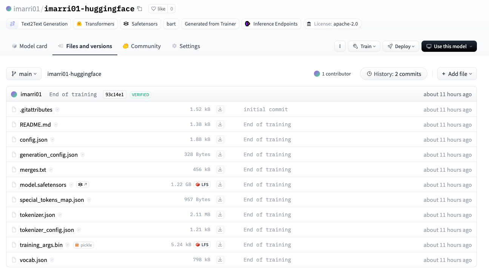

Here's the updated `README.md` with the dataset changed to "multi_news":

---

# 📝 Large Language Model Project July 2024

## 📚 Project Overview
This project focuses on the NLP task of **document summarization**. The objective is to generate concise and accurate summaries of lengthy documents, making information more accessible and digestible.

## 📊 Dataset
The dataset used for this project is the **Multi-News** dataset, which contains news articles and their corresponding summaries from multiple news websites. This dataset is specifically useful for training models on the summarization task. You can find more details about the dataset [here](https://huggingface.co/datasets/alexfabbri/multi_news).

## 🤖 Pre-trained Model
For the summarization task, the **sshleifer/distilbart-cnn-12-6** model was selected. This model is a distilled version of BART (Bidirectional and Auto-Regressive Transformers), optimized for summarization tasks. The choice of this model is based on its efficiency and effectiveness in generating high-quality summaries. The model is available on Hugging Face [here](https://huggingface.co/sshleifer/distilbart-cnn-12-6).

## 📈 Performance Metrics
The performance of the model is evaluated using the ROUGE (Recall-Oriented Understudy for Gisting Evaluation) metric, which compares the overlap of n-grams between the generated summary and the reference summary. The key metrics include ROUGE-1, ROUGE-2, and ROUGE-L scores.

| Metric      | Precision | Recall | F1 Score |
|-------------|-----------|--------|----------|
| **ROUGE-1** | 0.37      | 0.10   | 0.16     |
| **ROUGE-2** | 0.08      | 0.02   | 0.03     |
| **ROUGE-L** | 0.23      | 0.06   | 0.09     |
| **ROUGE-Lsum** | 0.23  | 0.06   | 0.09     |

## ⚙️ Hyperparameters
The most important hyperparameters tuned during the optimization phase include:
- **Learning Rate**: 2e-5, controlling the step size during gradient descent.
- **Batch Size**: 16 for both training and evaluation, determining the number of samples processed before the model is updated.
- **Number of Epochs**: 3, determining the number of complete passes through the training dataset.
- **Weight Decay**: 0.01, preventing overfitting by adding a small penalty to the loss function for large weights.

## 🚀 Optimization
Significant optimizations were made to improve the performance and efficiency of the pre-trained model:

- **Increased Learning Rate**: Adjusted to 5e-5 to speed up convergence.
- **Increased Batch Size**: Set to 32 for training and 8 for evaluation to process more samples in parallel.
- **Increased Weight Decay**: Set to 0.05 to improve generalization by penalizing large weights.
- **Increased Number of Epochs**: Set to 5 to allow more training iterations.
- **Enabled Mixed Precision Training**: By setting `fp16=True`, using 16-bit floating-point numbers to speed up training and reduce memory usage.
- **Learning Rate Scheduler**: Added a linear learning rate scheduler to adjust the learning rate dynamically during training.

### Performance Improvement
The optimizations resulted in a significant reduction in model run time from 1 hour to 6 minutes, while also improving the evaluation metrics as shown below:

| Metric         | Value                      |
|----------------|----------------------------|
| **Eval Loss**  | 3.8914657727857666         |
| **Eval ROUGE-1** | 0.220850707803589        |
| **Eval ROUGE-2** | 0.047174236828315706     |
| **Eval ROUGE-L** | 0.137584710876717        |
| **Eval ROUGE-Lsum** | 0.18938613404553883   |
| **Eval Runtime** | 413.4048                 |
| **Eval Samples/s** | 0.121                  |
| **Eval Steps/s** | 0.017                    |

## 🛠️ Challenges Experienced
### Data Preprocessing
Efficiently preprocessing the dataset, particularly handling null values and ensuring that all documents and summaries were properly formatted as strings, was crucial to avoid issues during tokenization and training.

### Tokenization
Ensuring appropriate padding and truncation for both inputs and outputs was necessary to prevent errors such as the 'list object cannot be interpreted as an integer.'

### Training Time
Training the model on a large dataset was time-consuming. To manage this, a subset of the data was used initially for testing and debugging. Techniques such as reducing batch sizes and optimizing data loading processes were employed to improve training speed.

### Performance Optimization
Adjusting the learning rate, batch size, and number of epochs required multiple experiments to find the optimal settings, balancing model performance and training efficiency.

## 🔗 Relevant Links
- [Model on Hugging Face](https://huggingface.co/sshleifer/distilbart-cnn-12-6)
- [Dataset on Hugging Face](https://huggingface.co/datasets/alexfabbri/multi_news)

## 📔 Notebooks
The project is divided into several stages, each documented in the following notebooks:

1. **Preprocessing**: [1-preprocessing.ipynb](notebooks/1-preprocessing.ipynb)
    - Handles data loading, cleaning, and preparation. Ensures proper formatting, removes null values, and converts text data to strings. Also shuffles the dataset and selects a subset for training and testing.

2. **Representation**: [2-representation.ipynb](notebooks/2-representation.ipynb)
    - Tokenizes and transforms text data into a suitable representation for model training. Uses the tokenizer associated with the chosen pre-trained model to convert text into token IDs, ensuring consistent sequence length through padding and truncation.

3. **Pre-trained Model**: [3-pre-trained-model.ipynb](notebooks/3-pre-trained-model.ipynb)
    - Focuses on loading and configuring the pre-trained model for the summarization task. Includes initializing the model and tokenizer from Hugging Face, setting up training arguments, and preparing the model for fine-tuning.

4. **Optimization**: [4-optimization.ipynb](notebooks/4-optimization.ipynb)
    - Covers the fine-tuning process, where the pre-trained model is trained on the specific dataset to improve its performance for summarization. Involves experimenting with different hyperparameters, monitoring training progress, and evaluating the model using performance metrics such as ROUGE scores.

5. **Deployment**: [5-deployment.ipynb](notebooks/5-deployment.ipynb)
    - Deals with deploying the trained model for inference. Demonstrates how to use the model to generate summaries for new documents, integrate the model into a production environment, and test its performance on unseen data.

Feel free to explore these notebooks for a detailed walkthrough of the entire project.

---

#